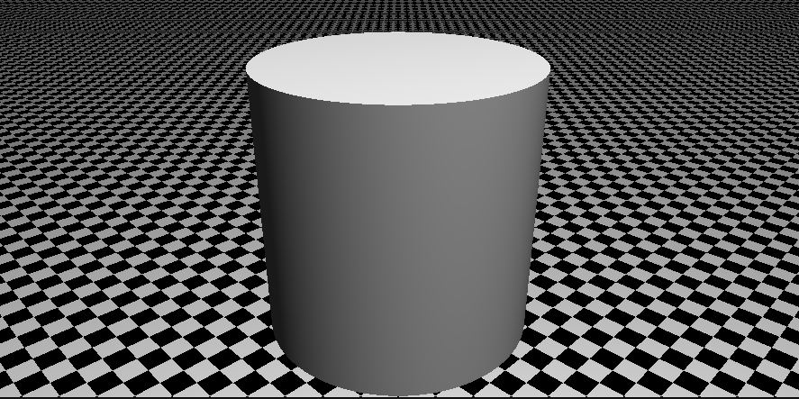

# Simple Raytracer Made in Rust

An implementation of a simple raytracer in Rust; based on the book The Ray Tracer Challenge by Jamis Buck (https://pragprog.com/titles/jbtracer/the-ray-tracer-challenge/).
I used this project to learn more about graphics and rust, as a result I prioritized learning rather than making a polished product,
so there may be some things that are non-idiomatic, unoptimized, and even poorly programmed.

Features:
* Geometry and Matrix Transformations
* Lighting
* Phong Reflection
* Camera and Scenes
* Shadows
* Planes, Cubes, Cylinders, Triangles
* Patterns
* Refraction
* Rendering OBJ Files (this is buggy depending on the camera and light location)

## Example Output

### Sphere Reflection

### Spheres

### OBJ File

### Cylinder

### Refraction

### Low Resolution Cube

